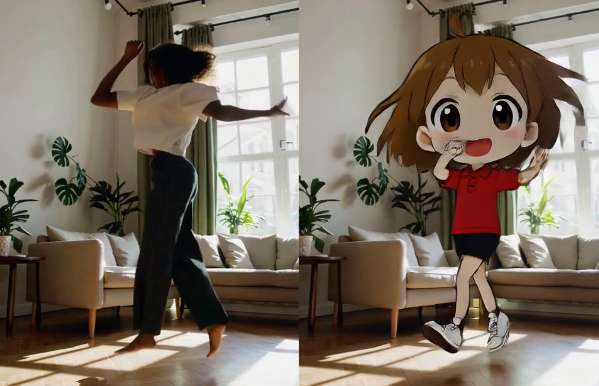
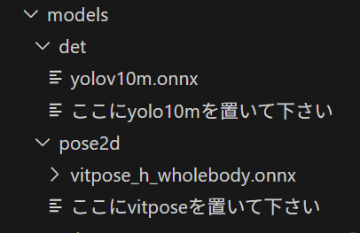
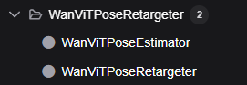
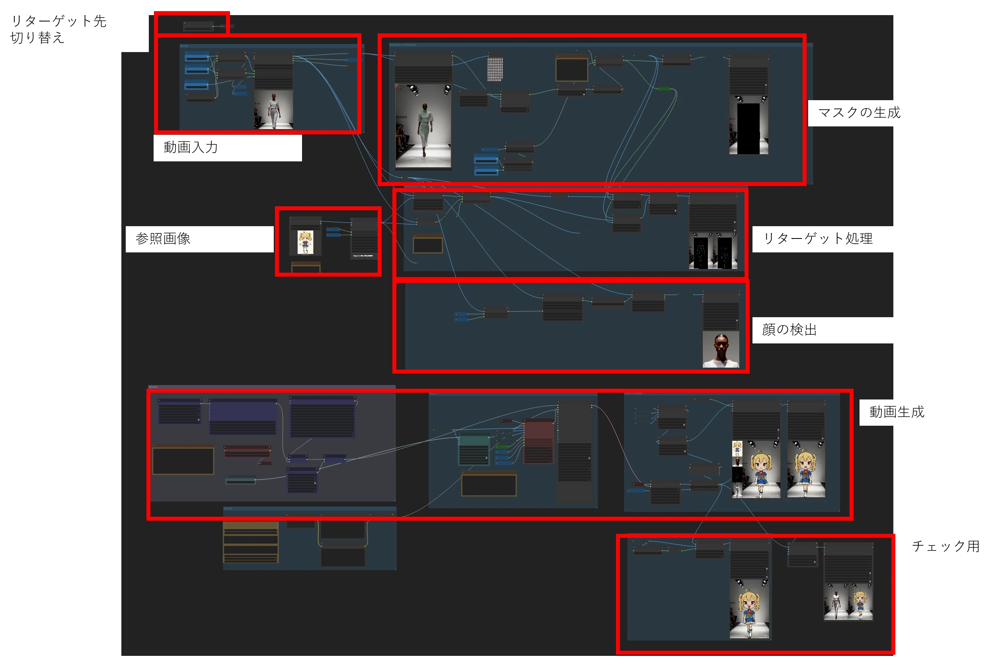
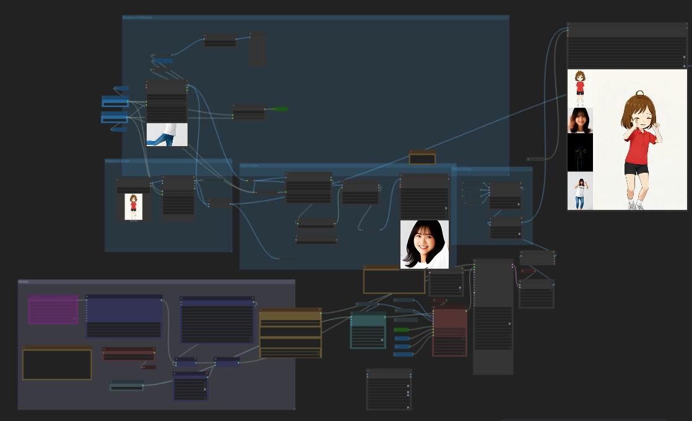

# このノードは先行公開されているノードです
* 開発中のため、想定外の動作をすることがあります。
* 今後仕様変更することがあります

# ComfyUI-WanViTPoseRetargeter

Wan2.2-Animateで実装されていたポーズリターゲット処理ののComfyUI移植です  
WanVideoWrapperを併用してお使いください
 
Wan2.2-Animateでは、以下の２つの使い方が示されています。
1. 参照画像を動画中の人物に反映する
2. 動画の動きを参照画像に反映する

2の使い方をするために動画ポーズを参照画像にリターゲットする処理がWan2.2 Animateで実装されていましたが、移植がありませんでしたのでそちらを移植しました。

また、1の使い方をする際はキャラクターを動画のポーズにするのですが、おそらくクオリティ上の制限からリターゲット処理を行っておらず、アニメキャラクターとリアルの人といったようにプロポーションが大きく異なるキャラクター間では、参照画像のキャラクターのプロポーションが大きく崩れる等問題がありました。

今回は、参照画像のプロポーションを動画の方にリターゲットすることで、リアルとアニメの融合を行えるようにすることを目指しました。

また、細かい調整用の機能を付けました。


## インストール
以下のようにcustom_nodesにComfyUI-WANViTPoseRetargeterを配置してください。
```bash
cd /path/to/ComfyUI/custom_nodes
git clone https://github.com/red-polo/ComfyUI-WanViTPoseRetargeter.git
# optionally install dependencies
# python -m pip install -r requirements.txt
```

カスタムノード中のmodelsフォルダの中に以下のようにモデルを配置してください。  



モデルは以下のリンク先のものをダウンロードして配置してください。

[yolo10m.onnx](https://huggingface.co/Wan-AI/Wan2.2-Animate-14B/tree/main/process_checkpoint/det)  
[vitposeh_wholebody.onnx](https://huggingface.co/Wan-AI/Wan2.2-Animate-14B/tree/main/process_checkpoint/pose2d)

vitpose_wholebody.onnxは以下のコマンドでDLできます。
```bash
hf download Wan-AI/Wan2.2-Animate-14B \
  --include "process_checkpoint/pose2d/**" \
  --local-dir ./Wan2.2-Animate-14B
```

ComfyUIを再起動し.以下のようにノードが入っていたら成功です。



## ノード

### **WanVitPoseRetargeter**


#### 概要
動画中のモーションを参照画像に適用する機能を持ったノードです。
#### 入力
* images  
動画からの入力
* ref_image  
参照画像  
#### 出力
* cond_images  
Wan2.2 Animateで使用できるポーズイメージです。

### **WanVitPoseRetargeterToSrc**


#### 概要
動画中のキャラクターを参照画像のキャラクターに置き換える機能を持ったノードです。
#### 入力
* images  
動画からの入力
* ref_image  
参照画像  
* adjust_scale  
拡大率です。微調整に使ってください。
* adjust_scale_anker  
拡大の際に原点となる場所です。
"neck": 首を原点として拡大します。
"around foot": 足元を原点として拡大します
* adjust_x  
横方向にポーズを移動します。微調整に使ってください。
* adjust_y  
縦方向にポーズを移動します。微調整に使ってください。
#### 出力
* cond_images  
Wan2.2 Animateで使用できるポーズイメージです。


## サンプルワークフロー

1. 参照画像を動画中の人物に反映する
[WanAnimatePoseRetarget_example_to_src.json](./sample_workflow/WanAnimatePoseRetarget_example_to_src.json)


2. 動画の動きを参照画像に反映する
[wan2.2-animate-move-workflow.json](./sample_workflow/wan2.2-animate-move-workflow.json)



## 関連リンク
* [Wan2.2](https://github.com/Wan-Video/Wan2.2)
* [ComfyUI-WanVideoWrapper](https://github.com/kijai/ComfyUI-WanVideoWrapper)