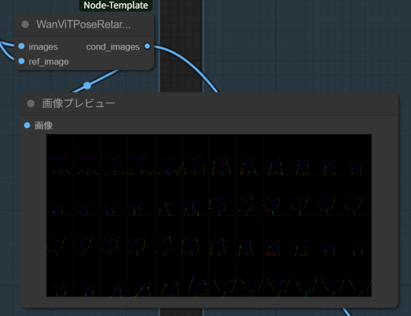

# ComfyUI-WanViTPoseRetargeter

Wan2.2-Animationで実装されていたPoseRetargetのComfyUI移植です
WanVideoWrapperを併用してお使いください

## Install (recommended)

以下のようにcustom_nodesにComfyUI-WANViTPoseRetargeterを配置してください。
```bash
cd /path/to/ComfyUI/custom_nodes
git clone https://github.com/yourname/ComfyUI-WANViTPoseRetargeter.git
# optionally install dependencies
# python -m pip install -r ComfyUI-Node-Template/requirements.txt
```

modelsフォルダの中に以下のようにモデルを配置してください。  


モデルは以下のリンク先のものをダウンロードして配置してください。
[yolo10m.onnx](https://huggingface.co/Wan-AI/Wan2.2-Animate-14B/tree/main/process_checkpoint/det)  
[vitposeh_wholebody.onnx](https://huggingface.co/Wan-AI/Wan2.2-Animate-14B/tree/main/process_checkpoint/pose2d)

ComfyUIを再起動し.以下のようにノードが入っていたら成功です。


## 使い方
WanViTPoseRetargeterのimagesに動画の画像出力を、ref_imageに参照画像を入力してください。  
cond_imagesからリターゲットされたポーズイメージが出力されます。


[サンプルワークフロー](./sample_workflow/wan2.2-animate-move-workflow.json)

